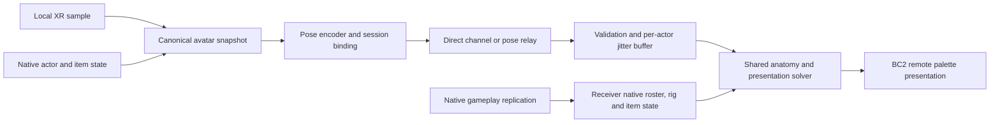

# Flatscreen visualizer and networking plan

## Prior Refractor result and release order

The user confirms their BF2142 project already achieved VR/flatscreen crossplay
with visible IK. Treat that as an implementation reference to inspect and reuse
for pose transport, remote presentation and compatibility decisions. BC2 still
needs its own verified player/session identity, third-person rig and gameplay
bindings; none of the Refractor native addresses or types belong in this adapter.
The campaign release and multiplayer are sequential deliverables. Multiplayer
remains an intended follow-on, not a prerequisite for the first single-player build.

As of October 1, 2026. Research and proposed interfaces only; no BC2 remote-pose
runtime, network listener, server or deployment was added by this task.

The intended addon lets a desktop BC2 player see a VR player's tracked head,
hands, upper body and supported weapon presentation. It should share the VR
mod's receiver and embodiment code while requiring neither a headset nor OpenXR.
A stock client without the addon continues to see native animation.

A **new native game-server extension is not inherently required for cosmetic pose
rendering**. A working BC2 gameplay session is required for actual players to
inhabit the same world; the visualizer additionally needs a pose transport and a
verified mapping from each sender to the correct native actor. Whether BC2 needs
a server extension to establish that mapping, expose a usable transport, or
support multiplayer tracked firing remains unresolved. An optional pose relay
can distribute poses but cannot host BC2 simulation or establish projectile
correctness by itself.

## Three distinct products

| Product | Needed data | Server implications |
| --- | --- | --- |
| Desktop mirror of the local VR image | Existing local rendered image/presentation path | No remote avatar protocol or game server required. Mirror quality/pacing is a separate presentation task |
| Local third-person spectator/avatar preview | Local tracked pose plus a verified local third-person rig/camera binding | Can be developed offline. It is not evidence of another client's avatar working |
| Flatscreen multiplayer visualizer | Sender pose, shared-session identity, remote native actor/rig, receiver presentation | Needs an existing multiplayer world plus a pose channel. A dedicated pose relay and a native game-server extension are separate choices |

The last row is the working interpretation of the user's request. A spectator on
another computer in a game session belongs in that row, even if it sends no poses.
This document does not promise that campaign can be turned into cooperative play.

EA's official online-service list records **December 8, 2023** for BC2 on PC,
PS3 and Xbox 360. Therefore the two-client stage must first verify a currently
usable, controlled hosting/backend route; it cannot assume EA's old online
service is available. No community service, server package or launcher was
installed, selected or tested here. [EA service updates](https://www.ea.com/legal/service-updates/a-h)

## Evidence available in the repositories

BC2 references below are current source, not inherited Refractor bindings:

- [Bc2Gameplay.cpp](../src/games/bc2/Bc2Gameplay.cpp), `Resolve`, reads the verified
  local-player chain and checks local/on-foot ownership. Its resolver passed to
  `rigPublication::Install` accepts only that local soldier. Removing this check
  is not a remote-avatar implementation.
- [Bc2Rig.cpp](../src/games/bc2/Bc2Rig.cpp), `ReadFirstPersonRig`, validates the
  first-person animation object, named topology, inverse binds, native evaluated
  palette and weapon-root relationship. Its published byte-preservation contract
  is useful, but those native getters/roles are not verified for third-person rigs.
- [Bc2RigPublication.cpp](../src/games/bc2/Bc2RigPublication.cpp) has one local
  tracking/calibration/publication state. Verified palette consumers receive
  private immutable copies after exact source/owner checks. A remote implementation
  needs per-actor state and its own native consumer evidence, not reuse of these
  singleton tracking or shot-publication globals.
- [Firing-origin evidence](FIRING-ORIGIN-20260930.md) proves campaign local-client
  and local-server player pairing using constructor/indexed-array relationships.
  It does not prove multiplayer connection identity, a full remote roster, a
  dedicated-server binding or remote projectile authority.
- [InputProtocol.h](../include/fvr/ipc/InputProtocol.h) and
  [FrameProtocol.h](../include/fvr/ipc/FrameProtocol.h) connect local game/XR
  processes. Their QPC deadlines, GPU resources and local space generations are
  **not an internet avatar protocol**. `RemoteFrameProvider` means another local
  process supplying frames, not another multiplayer avatar.
- [ArmIk](../include/fvr/interaction/ArmIk.h),
  [HandPose](../include/fvr/interaction/HandPose.h), tracked-body math and authored
  attachment policies are reusable after the receiver supplies a validated rig
  and canonical targets. The [porting roadmap](FROSTBITE-PORTING-ROADMAP.md) defines
  the corresponding per-title discovery and lifecycle gates.

The public 2142 tree was inspected read-only at
`<local-bf2142-workspace>\public-source\BF2142VR`, HEAD
`8bdf916d497fbd4ba258a25e5895322dd879c126`. Current source takes precedence over
older alpha descriptions. No credentials, launch configuration or deployment
files were needed, copied or changed.

| 2142 source | Reusable lesson | BC2 work still required |
| --- | --- | --- |
| `docs/FLAT_ADDON.md`; `NativeNetwork.cpp::InstallNetworkObserver` | Receiver-only desktop mode can use the same presentation path as VR without starting XR; subscription must not carry gameplay actions | Separate BC2 flat entry/packaging, native third-person bindings and tested subscription transport |
| `PoseProtocol.h/.cpp` | Explicit protocol version/size, no pointers, bounded values, packet ordering, per-peer freshness and finite rigid transforms | New Frostbite schema and identity/epoch model; do not send 2142 v4/616-byte packets unchanged |
| `NativeNetwork.cpp` remote finalize/restore/apply | Per-actor weak/skeleton identity and exact previous-write restoration prevent native LOD animation from feeding old IK back into itself | Native BC2 remote callback timing, lifecycle, LOD palette ownership and independently verified private-copy or restoration strategy |
| `RemotePresentation.cpp` | Reset presentation on discontinuities; smooth the hand and preserve its exact current weapon-to-palm relationship so the gun does not lag out of the hand | Explicit BC2 avatar/item roles, epoch-aware jitter interpolation and separate first-/third-person profiles |
| `RemoteArmMath.cpp`, `NativeRemoteWeapon.cpp` | Head, torso, arms, held weapon and body equipment have different ownership; fingers may collapse at distant LOD; native legs/stance remain useful | BC2 named roles, binds, hidden-leaf evidence and independently gated mesh/shadow handling; no copied 80-bone indices or bind angles |
| `NativeServer.cpp` | 2142's implementation relays to observers, validates native item/actor state and also owns authoritative VR aiming | Decide separately whether BC2 needs cosmetic relay integration versus authoritative gameplay bindings |
| `community/ProofHub.cs`, `BridgeServer.cs`, `BridgeClient.cs` | A claimed player number is not proof of native connection ownership; public transport binds session/generation through native join proof and authenticated transport | BC2 connection/roster evidence or a supported backend identity facility; do not reuse private keys, shared secrets, endpoints or native join commands |

2142's server dependency describes that implementation. It does not establish a
universal requirement that cosmetic remote IK must run on every game's server.
Its matrix payload combines presentation and gameplay events; the proposed
Frostbite cosmetic channel deliberately has no fire, turn, throw or reload command.

## Proposed module boundary

Names here are proposed responsibilities, not existing exported classes:

- `AvatarPoseSnapshot` is immutable canonical presentation intent: tracked head,
  anatomical palms, confidence, finger input availability and visual attachment
  roles. It carries source identity/time without any native address.
- `AvatarPoseCodec` validates and serializes that snapshot. `PoseTransport` moves
  bytes and manages authenticated connections; it never calls game animation or
  input from a network thread.
- `RemoteAvatarPresentation` owns a bounded buffer and solver history **per actor**.
  It accepts a validated native rig snapshot and outputs private pose edits.
- A title adapter supplies player/actor lifetimes, native body frame, skeleton and
  item bindings, animation/palette scheduling and exact fallback. Only that layer
  knows native offsets or mesh ownership.
- Local and remote presentation share calibrated anatomical roles and math, while
  first-person rig profiles and remote third-person profiles remain distinct.
  Local comfort-camera, roomscale input and shot policies do not become remote
  authority merely because their targets are reusable.

A future shared `BodyPoseTargets` may add root/pelvis/spine/feet with independent
Native, Estimated or Tracked provenance. This is optional schema preparation,
not an implemented full-body solver. The current first-person topology includes
leg/head bones, but their presence does not prove visible body mesh skin weights,
sections or culling membership. Current torso stabilization handles an upper-body
ancestor, not a complete avatar. The local adapter retains its collision root;
the remote adapter supplies the authoritative remote transform and epoch. Native
feet/locomotion remain the initial receiver fallback.

The flat mode loads the adapter/receiver/presentation subset. It needs no eyes,
GPU frame channel, tracked local-input injection or XR session. Ordinary desktop
input continues through native gameplay. Voice is a separate future capability;
it is not necessary to deliver this visualizer.

## Proposed network contract

Define a new independently versioned, explicitly encoded protocol; do not expose
C++ structs, STL objects, bool representation or compiler padding. Initial
encoding should be simple and uncompressed so fixtures can inspect every field.
The following semantics are required before choosing final byte offsets:

| Field group | Required meaning |
| --- | --- |
| Envelope | Magic, major/minor schema version, exact header/message length, message kind, capability mask, bounded extensions; unsupported required fields reject the packet |
| Session identity | Opaque match/world instance ID, authenticated sender connection ID and connection generation. Names, IP address or self-claimed numeric player ID alone do not prove ownership |
| Avatar lifetime | Sender avatar spawn generation plus receiver-owned mapping generation to a current native actor. Respawn, map change, reconnect and reused player slots invalidate the old association |
| Ordering and time | Monotonic sample sequence, sender monotonic capture time in specified units, sample validity, negotiated clock correlation/uncertainty and local receive time. QPC values are never treated as a shared clock across machines |
| Reference continuity | Tracking/recenter epoch and body-anchor discontinuity epoch. Epoch changes flush old interpolation and attachment state; old reordered packets cannot re-enter the new epoch |
| Spatial convention | Right-handed metres, +X right, +Y up, -Z forward; position xyz and normalized quaternion xyzw, explicitly parent-from-role orientation. Adapters convert their native/core conventions once, with roundtrip tests |
| Root relationship | Head, palms and item presentation are relative to the sampled native actor/body anchor; identify the native simulation tick if a verified mapping exists. Sender world root is optional consistency evidence, never authority to teleport the remote actor |
| Tracking | Independent head/left/right position/orientation validity and availability. Unavailable input is distinct from a valid zero curl/touch value. HMD pose, anatomical palm and controller grip are separate roles |
| Anatomy | Avatar rig-family/profile identity and revision; optional bounded user proportions with explicit provenance. Never transmit engine bone indices or a skeleton pointer. Receiver topology/bind calibration remains authoritative for its actual mesh |
| Hands | Per-hand Free, WeaponSupport, MechanismGrip or another negotiated presentation role; finger curls and touch availability, visual contact token and referenced item/mechanism. Roles describe display intent, not possession or a native interaction command |
| Items | Exact asset family/profile ID+revision, session-scoped item instance and equip generation, selected native mode, attachment role and anatomical parent. Same asset after dropping/picking up is a new instance. Rifle/launcher mode and held/holstered body equipment are not interchangeable roots |
| Optional mechanism display | Verified named mechanism role plus bounded cosmetic progress/state and matching item/contact generation. Generic bone names are not semantic roles; unknown or unsupported roles retain native animation |

Use reliable bounded control messages for protocol negotiation, roster/lifetime
binding and profile dictionaries; every pose still names the required epochs and
profile revision. Never infer that reliable delivery means the referenced native
actor/item is already present on the other client. Defer briefly within a bounded
queue or reject until both agree; release old attachments immediately.

As an initial experiment, send replaceable complete pose samples at approximately
30 Hz and cap each encoded pose below a negotiated datagram budget (target under
1,200 bytes including transport overhead). These are **proposed starting values**,
not measured BC2 requirements. Negotiate fixed profile IDs outside the pose stream;
do not stream whole skeletons, arbitrary strings, assets or engine matrices.
Measure bandwidth and CPU cost before adding compression. A sequence gap may drop
old poses, but must never invent a grip/equip acknowledgement.

A public channel needs authenticated session membership and replay protection;
no embedded project-wide secret or self-asserted roster mapping. A private local
fixture may explicitly provision two synthetic identities, but cannot be described
as proving public-client authentication. Treat parsed data as untrusted, with
finite/bounded transforms, normalized rotations, size/rate/count limits and
well-defined rejection counters. Keep transport/network work outside game threads;
consume immutable accepted snapshots on verified native animation boundaries.

## Receiver presentation and cleanup

1. Resolve a packet's authenticated match/connection/avatar identity to one current
   native actor. Verify actor generation, life/seat state, skeleton/bind revision
   and native equipped item/mode before allowing each independently gated feature.
   A receiver's own local first-person actor is excluded from remote posing.
2. Reject duplicates, rollback, obsolete epochs and implausible/expired samples.
   A repeated packet does not refresh freshness. New receive time alone cannot
   make a previously queued old sample fresh: use sender-age bounds with measured
   clock uncertainty as well as a local inactivity limit.
3. Buffer coherent whole samples and present at a small measured delay. Interpolate
   translation and normalized rotation within one epoch; head, hands, torso intent
   and fingers share a common sample time. Do not independently smooth the weapon
   away from its hand. Apply the interpolated hand with a coherent item-to-palm
   attachment; interpolate that relative attachment only when its role is unchanged.
4. Align relative targets with the receiver's **native rendered actor root** at the
   matching presentation time. If native tick/root timing cannot be correlated,
   disclose the initial relative-pose approximation and measure error under running,
   turning and network jitter. Do not apply a sender's world translation to gameplay.
5. Recenter, teleport, respawn, rig change and reconnect clear buffers, elbow history,
   hand contacts and weapon smoothing. Recenter is a presentation discontinuity,
   not a request to turn or move the receiving actor. Equipping a new item invalidates
   only affected item/hand caches unless avatar identity also changed.
6. Stale, untracked, dead, ragdolled, seated or unsupported actors return to native
   presentation. Prototype a hard freshness cap around 250 ms and a short bounded
   cosmetic blend, then measure it; no extrapolation that indefinitely chases a lost
   hand. Death/owner/space changes clear immediately. One missing hand need not
   discard a valid independent head, but it cannot retain a weapon/contact requiring it.
7. Use a verified private palette copy where BC2 supports it. If a later remote
   binding must edit a native palette, it needs a separate exact-write restoration
   proof before enabling: restore only this generation's unchanged prior writes,
   never another system's later output. LOD skipping and worker-thread consumers
   must not use last frame's solved pose as authored anatomy.

Leg locomotion, collision, stance, damage, projectiles, ammunition, inventory and
native equip remain owned by BC2. The visualizer does not change hitboxes, move
collision actors, accept native actions from pose packets, or enable arbitrary
client muzzle overrides. It can display an item only after matching native state;
unknown hand/weapon geometry falls back without hiding the character.

Current campaign translated-shot proof is insufficient for multiplayer. If a
remote VR gun visually points away from the server's native aim, record that as
an independent gameplay integration gap rather than silently changing observer
projectiles to match cosmetic data.

## Topology decision

| Option | Useful first scope | What must be proved before selecting it |
| --- | --- | --- |
| Local in-memory/file replay | Decoder, two actors, interpolation, IK and lifecycle faults | No server needed; proves presentation/data isolation only |
| Direct peer pose channel | Controlled two-client LAN/private fixture | Both already share a native world; verified peer→actor mapping, transport support and cleanup. Internet discovery/NAT is additional work |
| Standalone pose relay | Multiple observers and later internet routing | Authenticated match/roster leases, actor ownership proof, loss/jitter behavior and relevance filtering. Relay is separate from native simulation and may be colocated with a host |
| Existing game/backend extension | When verified APIs already expose identity, subscriptions or arbitrary bounded pose messages | Actual supported API, message lifetime, limits and native update ordering. No assumption BC2 has a suitable channel |
| Native BC2 server adapter | If required for join ownership proof, authoritative pose transport or later controller-driven native gameplay | Exact server build/ABI/roster/callbacks and permitted controlled hosting. Client campaign offsets do not identify dedicated-server layouts |

Recommend transport-independent receiver work first, then a private two-client
cosmetic path using the smallest proven identity/transport facility. A relay is a
practical later distribution option; choose it after establishing native player
identity. Do not start by building a replacement BC2 server or copying the 2142
server adapter. No evidence currently shows either is necessary for the visualizer.

## Concrete next tasks and acceptance gates

| Stage | Deliverable | Acceptance evidence |
| --- | --- | --- |
| 1. Offline two-actor fixture | Proposed codec, actor cache and shared presentation solver fed by captured canonical poses or deterministic synthetic samples; separate A/B rigs and lifetimes | A's poses change B only when explicitly mapped; local actor excluded; malformed sizes/NaNs, reordered packets, identity reuse, recenter, item changes, stale data and per-hand loss reject/fall back correctly. No game server, network service or live hook required |
| 2. BC2 third-person discovery | Read-only capture of one nonlocal campaign actor/NPC's native rig, render consumers and lifecycle; exact source build evidence | Named head/torso/arm/finger/item roles, units/binds, private palette boundary, LOD transitions and thread ownership verified. NPC success does not prove remote-player ownership or networking |
| 3. Controlled local two-actor display | Explicit test mapping from local tracked/synthetic sender to that validated nonlocal actor, behind a diagnostic gate | Before/after source hashes, zero source drift, native hips/legs/equipment preserved, no local camera/weapon/shots changed; near/far LOD, pause/loading and disable restore native presentation. Human monitor review confirms anatomy |
| 4. Hosting and identity inventory | Verify a currently usable controlled BC2 host/backend, two owned test clients and reliable native roster/connection mapping | Both clients join the same map; actor spawn/equip/leave/rejoin mapping proved independently of display names; record host/client versions. Decide whether a native server extension is actually needed before writing one |
| 5. Private two-client cosmetic path | VR sender plus receiver-only flat addon using verified direct/relay/game channel | Second player sees head/arms/hands and one supported native held item; compare synchronized source/receiver timestamps, rendered root relationship and pose age; no XR requirement on receiver; game inputs/fire/inventory remain native |
| 6. Failure and scale test | Inject loss, jitter, reordering and disconnect into controlled transport; exercise respawn/equip/LOD/recenter | No cross-player posing, stuck hands, hidden default weapon, stale native writes or unbounded queues; report bandwidth/CPU/pose-age percentiles. Stock clients remain native; unsupported profiles fall back |
| 7. Optional public/package work | Reversible flat package, supported host integration and separate authentication/transport review | Exact package tested on two machines; explicit compatibility table and uninstall; no game assets, native binaries, endpoints or secrets borrowed from the 2142 deployment |

Stage 1 can proceed independently of a headset or multiplayer service. Stages 2
and 3 require their own native binding review; they do not authorize removing the
current local-only guards. Server deployment and public multiplayer integration
are later concrete tasks, not actions performed by this plan.

Unresolved before any server commitment: usable BC2 host/backend and installation;
remote roster identity/connection lifetime; third-person rig and palette ownership;
remote item/mode mapping; native root interpolation timing; supported transport or
join-proof mechanism; and any separate authoritative firing requirements. No
current BC2 remote-visualizer or two-client acceptance is claimed.

## Research provenance

The 2142 files below identify the actual reviewed source rather than relying only
on its repository HEAD. Native offsets, credentials and deployed configuration
were not imported. BC2 source references are intentionally to the evolving current
workspace; implementation will need its own exact-build evidence manifest.

| Reviewed 2142 source | SHA-256 |
| --- | --- |
| `src/bf2142/multiplayer/PoseProtocol.h` | `f8bb70c4636eb95c16613d686378e208b2981982a8ccee71751e0985f87cf016` |
| `src/bf2142/multiplayer/NativeNetwork.cpp` | `d32866adc2569c3b89e508ab6938f1a957658157bdf8e6ccdaa99f7491510db3` |
| `src/bf2142/multiplayer/RemotePresentation.cpp` | `550809edbee404ee44186ea1af5579a51a9e878a0ef043d7fae8b3e4a15e5919` |
| `src/community/ProofHub.cs` | `7b39cdeb05b2c355e0d4036938aa72d051f48e3f66fb39eb9b9f75f170f55b52` |
